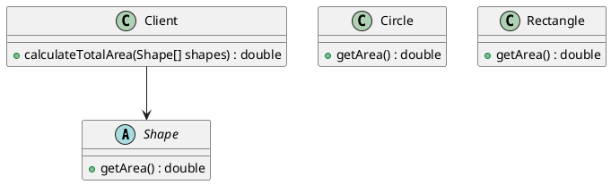
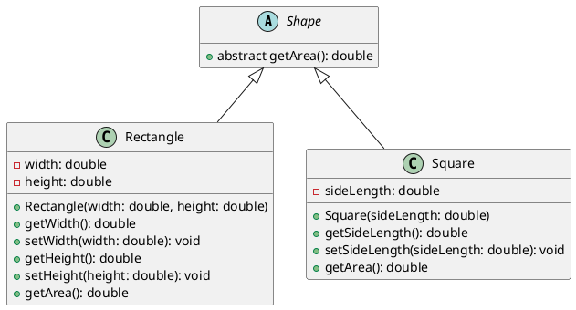

# Liskove Substitution Principle

The LSP says that you should be able to substitute a parent(or base) type with a subtype.

```plantuml

@startuml
abstract class Shape {
    + getArea() : double
}

class Circle {
    + getArea() : double
}

class Rectangle {
    + getArea() : double
}

class Client {
    + calculateTotalArea(Shape[] shapes) : double
}
Client --> Shape

@enduml

```

Simple full example: -

```plantuml

@startuml

skinparam linetype {
    topBottomMargin 40
}

abstract class Shape {
    + abstract getArea(): double
}

class Rectangle {
    - width: double
    - height: double
    
    + Rectangle(width: double, height: double)
    + getWidth(): double
    + setWidth(width: double): void
    + getHeight(): double
    + setHeight(height: double): void
    + getArea(): double
}

class Square {
    - sideLength: double
    
    + Square(sideLength: double)
    + getSideLength(): double
    + setSideLength(sideLength: double): void
    + getArea(): double
}

Shape <|-- Rectangle
Shape <|-- Square

@enduml

```
