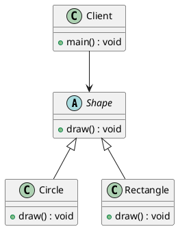

#uncle bob - SOLID Principle

1. SRP - Single Responsibility Principle
2. Open-Closed Principle - OCP
3. Listkov Substitution Principle - LSP
4. Interface Segregation Principle
5. Dependency Inversion Principle

6. OCP:

The software artifact should be open for extention but closed for modification.

For, simplicity, lets assume a perticular college has the following four departments:

1. Computer Science
2. Physics
3. History
4. English

Demonstratin:

